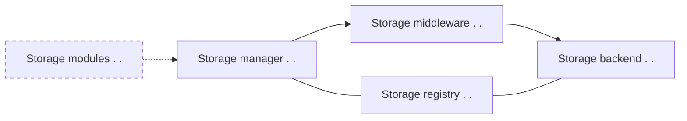

# What is Storex

Storex is a minimal storage layer as a foundation for easing common problems around storing and moving data around. Allowing you to describe your data layout in a standardized way and providing different plugins, it helps you interact with (No)SQL databases, data migration, offline first applications architecture, creating and consuming REST/GraphQL APIs, permission management, finding optimization opportunaties and more.

The aim is to provide a minimalistic common ground/language for working with your data, providing packages for solving the most common problems around data, while giving you easy access to the underlying machinery to do the things that are specific to your application. Everything together that means that every problem you encounter while rapidly iterating towards a serious product, from choosing a suitable DB to suddenly realizing you need to migrate your data model, or even switch DBs, will get a ton easier because you don't have to solve them for the 109th time yourself.

_This project started as the storage layer for Memex, a tool to organize your web-research for yourself and collaboratively, in collaboration with [YouAPT](https://www.youapt.eu/). Download it [here](https://worldbrain.io/), and check out our vision [here](https://worldbrain.io/vision)._

# Why does Storex exist?

Over the years, many storage technologies and architectures have been researched and developed. Each of these technologies consists different trade-offs, specializations and ideas. As an industry, we've seen that the way these technologies invent re-combine different building blocks has lead to many ongoing heated debates, rewrites of products and a continuous reinventing of the same building blocks that are needed in real-world applications hindering user-driven innovation.

Storex aims to identify the building blocks that have been re-combined in various ways in different storage technologies and architectures, and provide the industry with modules providing a common way to speak about these issues (live schema migration, access control, offline-first, live-debugging micro-service architectures, etc.) in ways that they can be re-combined according to different use-cases.

At the simplest level, this allows for applications to adapt to new storage architectures with drastically reduced effort, reducing the amount of re-writes (read: wasted energy and money that could have been used to produce value for society) and allowing for more research technologies which as a result have a greater chance to be adopted. Also, it allows for technologies to be chosen based on requirements emerging from high-fidelity prototyping and measurements, instead of up-front research when requirements are still vague. This enables a whole new level of user-driven development, and potentially changes the choice of technology from an (often not entirely rational) debate to data-driven application architecting. With this, and by creating a common tool-chain for traditionally conflicted communities (centralized vs. decentralized, SQL vs. NoSQL, etc.) we hope to increase the amount of unity in the tech industry, while reducing wasted resources.

# How does Storex work?



Storex at its core does two things:

1. Allow you to describe your data model in a standard way using the `StorageRegistry`
1. Allow you to execute standardized and custom operations on your data using a `StorageBackend` (currently backends are available for IndexedDB, SQL databases, Firebaase and experimentally MongoDB.)

The `StorageManager` class combines both of these classes in a single class that the rest of your application can interact with, possibly sending each operation you request to execute on your data through various `StorageMiddleware`.

```js
import StorageManager, { StorageBackend, StorageRegistry } from "@worldbrain/storex";
import { DexieStorageBackend } from "@worldbrain/storex-backend-dexie";
import inMemory from "@worldbrain/storex-backend-dexie/lib/in-memory";

export async function demo() {
    const backend = new DexieStorageBackend({ dbName: 'demo', idbImplementation: inMemory() })
    const storageManager = new StorageManager({ backend: clientStorageBackend })
    storageManager.registry.registerCollections({
        user: { ... } // More details in the storage registry guide
    })
    await storageManager.finishInitialization()

    storageManager.setMiddleware([
        {
            async process({ operation, next }) {
                console.log('executing operation', operation)
                return next.process({ operation })
            }
        }
    ])

    const { object } = await storageManager.operation('createObject', 'user', { displayName: 'Jane' })
    await storageManager.operation('updateObject', 'user', { id: object.id }, { displayName: 'Jane Doe' })
}
```

On top of this, we can optionally organize different parts of our storage logic into storage module, which do nothing more than providing a convenient way to expose information about a logical part of your storage logic in a coherent way:

```js
import {
  StorageModule,
  StorageModuleConfig,
  registerModuleMapCollections
} from "@worldbrain/storex-pattern-modules";

class TodoListStorage extends StorageModule {
  getConfig(): StorageModuleConfig {
    // More details in the storage modules guide
    return {
      // What you'd pass to StorageRegistry.registerCollections(), but with a bit more info
      collections: { ... },

      // Templates of operations passed to StorageManager.operation()
      operations: {
          createList: { ... },
      },

      // Info about exposed methods, which you can use to generate REST/GraphQL endpoints for example
      methods: {
          createTodoList: { ... },
      },

      // Access and valdation rules determining who can execute what operations on what data
      accessRules: { ... }
    };
  }

  async createTodoList(list: { name: string }) {
      return (await this.operation('createList', list)).object
  }
}

export async function demo() {
    const backend = new DexieStorageBackend({ dbName: 'demo', idbImplementation: inMemory() })
    const storageManager = new StorageManager({ backend: clientStorageBackend })
    const todoLists = new TodoListStorage({ storageManager })
    registerModuleMapCollections(storageManager.registry, { todoLists })
    await storageManager.finishInitialization()
}
```

Using this higher-level organization, you can:

- Automatically register the collections for all the different parts of your program with the storage registry in one standard place
- Automatically generate API providers/consumers, so whether you run all this in the browser while testing, or on a server, becomes an implementation detail you can code out in one isolated place instead of having implementation details like REST vs GraphQL spread throughout your application.
- Generate useful reports about what kind of operations you're doing on your data to look for optimization opportunities.
- Use the access rules the encforce access control in different ways, whether it's using a storage middleware that enforces these rules, compiling them to [Google Cloud Firestore security rules](https://firebase.google.com/docs/firestore/security/get-started) or one could even imagine compiling them into an Ethereum smart contract (although this'd a bit more work in exposing more information about storage module methods.)
- Get rid of Storex entirely if you wish so, because the rest of your application the UI and business logic only talk to the methods you've exposed on your storage modules, which have nothing to with Storex per ṡé.

All of this together, you can create rapidly iterate on highly flexible applications that run across a variety of architectures. In fact, when buidling a new application it's totally feasible to start with a completely in-memory store until you get the requirements and UI right, after which you use the information you gathered and the kind of operations you execute to either move the entire storage to PostgreSQL, Firestore or DynamoDB, which'd normally be radical rewrites of the storage layer. The `storex-sync` package uses this to provide a multi-device sync that can use Firestore as it's backend, a custom cloud solution, or decentralized solutions.

# What next?

If you're a developer and here for the first time, start exploring the [quickstart](/guides/quickstart/) and the rest of the [guides](/guides/). <!-- Be sure to check out the [Best practices](/best-practices/) after that though. -->

<!-- If you want to see Storex working with the database of your choice, check out the guide on [creating a new storage backend](/advanced-usage/creating-storage-backend/) -->

If you're a decision maker trying to figure out how Storex might make sense for your organization, check out the [case studies](/case-studies/) and [use cases](/use-cases/).
