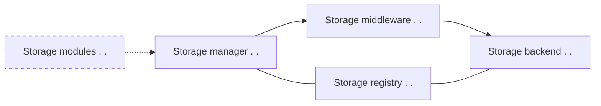

# What is Storex

Storex is a minimal storage layer as a foundation for easing common problems around storing and moving data around. Allowing you to describe your data layout in a standardized way and providing different plugins, it helps you interact with (No)SQL databases, data migration, offline first applications architecture, creating and consuming REST/GraphQL APIs, permission management, finding optimization opportunaties and more.

The aim is to provide a minimalistic common ground/language for working with your data, providing packages for solving the most common problems around data, while giving you easy access to the underlying machinery to do the things that are specific to your application. Everything together that means that every problem you encounter while rapidly iterating towards a serious product, from choosing a suitable DB to suddenly realizing you need to migrate your data model, or even switch DBs, will get a ton easier because you don't have to solve them for the 109th time yourself.

_This project started as the storage layer for Memex, a tool to organize your web-research for yourself and collaboratively, in collaboration with [YouAPT](https://www.youapt.eu/). Download it [here](https://worldbrain.io/), and check out our vision [here](https://worldbrain.io/vision)._

# How does Storex work?

# What next?

TBD
