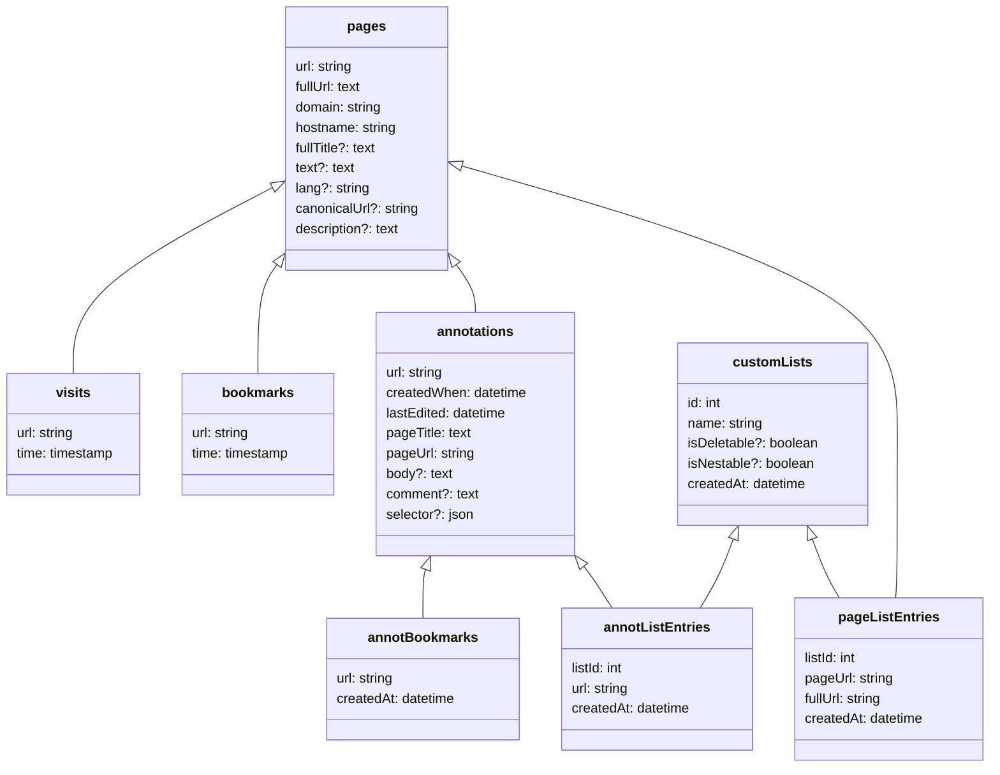

# Integrating with Memex

```mermaid
classDiagram
    pages <|-- visits
    pages <|-- bookmarks
    pages <|-- annotations
    pages <|-- pageListEntries
    customLists <|-- pageListEntries
    customLists <|-- annotListEntries
    annotations <|-- annotListEntries
    annotations <|-- annotBookmarks

    class pages {
        url: string
        fullUrl: text
        domain: string
        hostname: string
        fullTitle?: text
        text?: text
        lang?: string
        canonicalUrl?: string
        description?: text
    }
    class visits {
        url: string
        time: timestamp
    }
    class bookmarks {
        url: string
        time: timestamp
    }
    class customLists {
        id: int
        name: string
        isDeletable?: boolean
        isNestable?: boolean
        createdAt: datetime
    }
    class pageListEntries {
        listId: int
        pageUrl: string
        fullUrl: string
        createdAt: datetime
    }
    class annotations {
        url: string
        createdWhen: datetime
        lastEdited: datetime
        pageTitle: text
        pageUrl: string
        body?: text
        comment?: text
        selector?: json
    }
    class annotBookmarks {
        url: string
        createdAt: datetime
    }
    class annotListEntries {
        listId: int
        url: string
        createdAt: datetime
    }
```
