# Integrating with Memex

- Memex runs as an extension, does not connect to Storex Hub by default
- When requested, you can have it report changes to the database. See [interacting with other applications](/guides/storex-hub/remote-apps/)
- You can store and retrieve data from Memex, also see [interacting with other applications](/guides/storex-hub/remote-apps/)
- Here are the things you should know:
  - You should only index pages the user intends to be included in their history of seen things. Yes: imports from Pocket or CSV, liked Tweets. No: every article the most interesting people I follow on Twitter posted, since it's not my memory, but collective memory.
  - You should not manually index pages, but instead use the remote call for that.

## Data model

```mermaid
classDiagram
    pages <|-- visits
    pages <|-- bookmarks
    pages <|-- annotations
    pages <|-- pageListEntries
    customLists <|-- pageListEntries
    customLists <|-- annotListEntries
    annotations <|-- annotListEntries
    annotations <|-- annotBookmarks

    class pages {
        url: string
        fullUrl: text
        domain: string
        hostname: string
        fullTitle?: text
        text?: text
        lang?: string
        canonicalUrl?: string
        description?: text
    }
    class visits {
        url: string
        time: timestamp
    }
    class bookmarks {
        url: string
        time: timestamp
    }
    class customLists {
        id: int
        name: string
        isDeletable?: boolean
        isNestable?: boolean
        createdAt: datetime
    }
    class pageListEntries {
        listId: int
        pageUrl: string
        fullUrl: string
        createdAt: datetime
    }
    class annotations {
        url: string
        createdWhen: datetime
        lastEdited: datetime
        pageTitle: text
        pageUrl: string
        body?: text
        comment?: text
        selector?: json
    }
    class annotBookmarks {
        url: string
        createdAt: datetime
    }
    class annotListEntries {
        listId: int
        url: string
        createdAt: datetime
    }
```



- Optional fields are marked with `?`
- The `url` field of in `annotations` is it's ID, in the format of `http://www.page.com#creationTimestamp`. The `url` field in `annotBookmarks` and `annotListEntries`
- All the other `url` fields in `pages`, `bookmarks`, `visits` and `pageListEntries` are normalized URLs.

Example - get all pages tagged with `share-test`:

```js
const { status, result: pages } = await api.executeRemoteOperation({
  app: "io.worldbrain.memex",
  operation: ["findObjects", "tags", { name: "share-test" }],
});
```

Example - get all pages visited in the last 3 hours `share-test`:

```js
const { status: result: visits } = await api.executeRemoteOperation({
  app: "io.worldbrain.memex",
  operation: [
    "findObjects",
    "visits",
    { time: { $gt: Date.now() - 1000 * 60 * 3 } },
  ],
});
```

Example - get page details by URL:

```js
const { status, result: page } = await api.executeRemoteOperation({
  app: "io.worldbrain.memex",
  operation: ["findObjects", "pages", { url: "test.com/" }],
});
```

## Remote calls

### indexPage

```js
interface IndexPageArgs {
  url: string;
  visitTime?: number;
  bookmark?: true | { creationTime: number };
  tags?: string[];
}
```

Example

```js
const { status } = await api.executeRemoteCall({
  app: "io.worldbrain.memex",
  call: "indexPage",
  args: {
    url: "https://en.wikipedia.org/wiki/Memex",
    visitTime: Date.now(), // Is set to Date.now() if omitted
    bookmark: true,
    tags: ["my-tag"],
  },
});
if (status === "success") {
  // do something
}
```
