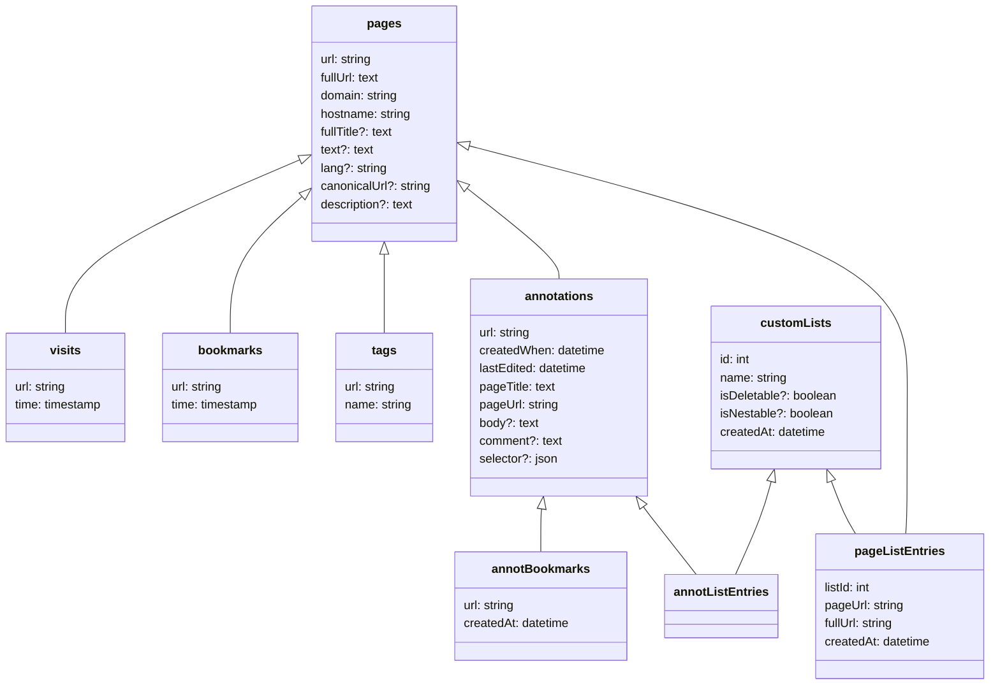

# Integrating with Memex

Integrating with Memex allows you to:

1. Listen to data changes in Memex and process them
2. Index urls on demand
3. Export & import data on demand

## Setting up the environment.

### Enable feature that Memex can talk to outside applications

By default Memex does not connect to Storex Hub. To open the connection open the background console of Memex and type:

##### Go to the background console of the extension

- Firefox: [about:devtools-toolbox?type=extension&id=info%40worldbrain.io](about:devtools-toolbox?type=extension&id=info%40worldbrain.io)
- Chrome: `chrome://extensions > enable developer mode > Memex > background page > console`

##### Enter these commands into the console

- When you're developing a plugin using the development version of Storex Hub: `await bgModules.storexHub.connect({ development: true })`
- To connect to your production, standalone version of Storex Hub: `await bgModules.storexHub.connect()`

### Setup your Storex Hub developer environment

Follow the [Storex Hub development guide](/storex-hub/guides/plugin-dev-guide/)

### Create an plugin or connect an external app

- Create your client (in an external app) or get the API (in a plugin) with a `handleEvent` callback. ([Example](https://github.com/WorldBrain/storex-hub-integration-memex-arweave/blob/878bf121bfba36ddf734dead9eba9e1272b61764/ts/application.ts#L44))
- You listen to when Memex is started again ([Example 1](https://github.com/WorldBrain/storex-hub-integration-memex-arweave/blob/878bf121bfba36ddf734dead9eba9e1272b61764/ts/application.ts#L162), [Example 2](https://github.com/WorldBrain/storex-hub-integration-memex-arweave/blob/878bf121bfba36ddf734dead9eba9e1272b61764/ts/application.ts#L47))

## Use Cases:

### Use Case 1: Listen and process data changes in Memex

With this method you can listen to every change in Memex and process it individually.
Memex & your browser needs to be running to receive and process changes.

An example implementation can be found [here](https://github.com/WorldBrain/storex-hub-integration-memex-arweave/blob/878bf121bfba36ddf734dead9eba9e1272b61764/ts/application.ts#L43).

**Note:** Memex/Storex Hub do not buffer changes yet. Meaning in order for the connections to work, both Storex Hub and Memex need to run. Get in touch with us [via the chat](https://worldbrain.slack.com/join/shared_invite/enQtOTcwMjQxNTgyNTE4LTRhYTAzN2QwNmM3ZjQwMGE5MzllZDM3N2E5OTFjY2FmY2JmOTY3ZWJhNGEyNWRiMzU5NTZjMzU0MWJhOTA2ZDA) if you like to contribute to improving this.

### Use Case 2: Index urls on demand

You can use Memex internal indexing process to add new urls to your Memex history/bookmarks.

```js
interface IndexPageArgs {
  url: string;
  visitTime?: number;
  bookmark?: true | { creationTime: number };
  tags?: string[];
}
```

```js
const { status } = await api.executeRemoteCall({
  app: "io.worldbrain.memex",
  call: "indexPage",
  args: {
    url: "https://en.wikipedia.org/wiki/Memex",
    visitTime: Date.now(), // Is set to Date.now() if omitted
    bookmark: true,
    tags: ["my-tag", "my-tag2"],
    customLists: ["<ID>", "<ID2>"], // You find a list's ID via the background console (see data explorer guide in Use Case 3)
  },
});
if (status === "success") {
  // do something
}
```

### Use Case 3: Import/Export data on demand:

With this method you can query Memex data or save new things to the database. An example can be found [here](https://github.com/WorldBrain/storex-hub-integration-memex-arweave/blob/878bf121bfba36ddf734dead9eba9e1272b61764/ts/application.ts#L76). The storage operations you can execute with `executeRemoteOperation()` are the standard Storex operations described [here](/guides/storage-operations/) and [here](/guides/quickstart/?id=manipulating-data).

If you want to inspect the data model of Memex, you can do so via the database explorer of the broswer you're running Memex in:

- Firefox: [about:devtools-toolbox?type=extension&id=info%40worldbrain.io](about:devtools-toolbox?type=extension&id=info%40worldbrain.io) `storage > IndexedDB > memex`
- Chrome: `chrome://extensions > enable developer mode > Memex > background page > Application > IndexedDB > memex`

#### Examples:

##### Get all pages tagged with `share-test`:

```js
const { status, result: pages } = await api.executeRemoteOperation({
  app: "io.worldbrain.memex",
  operation: ["findObjects", "tags", { name: "share-test" }],
});
```

##### Get all pages visited in the last 3 hours:

```js
const { status: result: visits } = await api.executeRemoteOperation({
  app: "io.worldbrain.memex",
  operation: [
    "findObjects",
    "visits",
    { time: { $gt: Date.now() - 1000 * 60 * 3 } },
  ],
});
```

##### Get page details by URL

With the above commands you will only get the respective url back (and tag/visit time respectively).
To get all page data, like `title`, `text` or other metadata, you need to then loop through your previous results and fetch the page data with the following command.

```js
const { status, result: page } = await api.executeRemoteOperation({
  app: "io.worldbrain.memex",
  operation: ["findObjects", "pages", { url: "test.com" }],
});
```

##### Add a new page object

You can either full-text index a `url` via the Memex indexing function (2.2) or manually add a page object if you have all necessary data already.
Note: This is not indexing the page, just populating the database with the data you entered.

```js
const { status, result: page } = await api.executeRemoteOperation({
  app: "io.worldbrain.memex",
  operation: [
    "createObject",
    "pages",
    {
      canonicalUrl: undefined,
      domain: "mozilla.org",
      fullTitle:
        "Source Code Upload :: WorldBrain's Memex :: Add-ons for Firefox",
      fullUrl: "https://addons.mozilla.org/en-GB/developers/addon/worldbrain",
      hostname: "addons.mozilla.org",
      text: "lorem ipsum",
      url: "addons.mozilla.org/en-GB/developers/addon/worldbrain",
    },
  ],
});
```

##### Add a tag to an existing page

Make sure the respective PAGE object (4. or 2.2) does already exist otherwise the tag can't be displayed

```js
const { status, result: page } = await api.executeRemoteOperation({
  app: "io.worldbrain.memex",
  operation: ["createObject", "tags", { url: "test.com", name: "my-tag" }],
});
```

##### Create a new list

You can either add a page to an existing list, or adding a new list. But in order to add an item to a list (6.), the list needs to exist beforehand.

```js
const { status, result: page } = await api.executeRemoteOperation({
  app: "io.worldbrain.memex",
  operation: [
    "createObject",
    "customLists",
    {
      createdAt: Date.now(),
      isDeletable: 1, // 0 for lists that can't be removed like the "saved from mobile" list
      isNestable: 1, // non-used parameter preparing us for nested lists
      name: "Great tools for thought",
    },
  ],
});
```

##### Get all Mememx lists

```js
const { status, result: page } = await api.executeRemoteOperation({
  app: "io.worldbrain.memex",
  operation: ["findObjects", "customLists"],
});
```

##### Find a specific Memex list with its name

```js
const { status, result: page } = await api.executeRemoteOperation({
  app: "io.worldbrain.memex",
  operation: ["findObject", "customLists", { name: "Great tools for thought" }],
});
```

##### Add a new item to a list

To add a new item to a list make sure the PAGE object does already exist otherwise the entry won't appear in the list

```js
const { status, result: page } = await api.executeRemoteOperation({
  app: "io.worldbrain.memex",
  operation: [
    "createObject",
    "pageListEntries",
    {
      createdAt: Date.now(),
      fullUrl: "https://www.test.com/about-us",
      listId: 12345678, //existing or newly created through process "create new list"
      pageUrl: "test.com/about-us", // normalised format without http(s) and www.
    },
  ],
});
```

##### Add a bookmark to an existing page

Make sure the PAGE object does already exist otherwise the bookmark status can't be displayed. It will be saved though.

```js
const { status, result: page } = await api.executeRemoteOperation({
  app: "io.worldbrain.memex",
  operation: [
    "createObject",
    "bookmarks",
    { url: "test.com/about-us", time: Date.now() },
  ],
});
```

## Understanding Memex' data model

### How to read this

- Optional fields are marked with `?`
- Generally the ID of each data class is the first field (mostly `url`)
  - Exceptions:
    - annotations: The `url` + `createdWhen` field ID in the format: `http://www.page.com#creationTimestamp`
    - annotBookmarks: The respective annotation's url in the format: `http://www.page.com#creationTimestamp`
    - pageListEntries: The customLists ID + `url` as an array the format: `[1, 'http://www.page.com']`
- `url` fields in `pages`, `bookmarks`, `visits` and `pageListEntries` are normalized URLs.
- All the data classes with an arrow to another class can't be displayed without their existence. (e.g. `bookmarks` status without having a `pages` object)
- If you want to inspect the data model of Memex, you can do so via the browser database explorer.
  - **This is how to find it:**
    - Firefox: [about:devtools-toolbox?type=extension&id=info%40worldbrain.io](about:devtools-toolbox?type=extension&id=info%40worldbrain.io) `storage > IndexedDB > memex`
    - Chrome: `chrome://extensions > enable developer mode > Memex > background page > Application > IndexedDB > memex`


