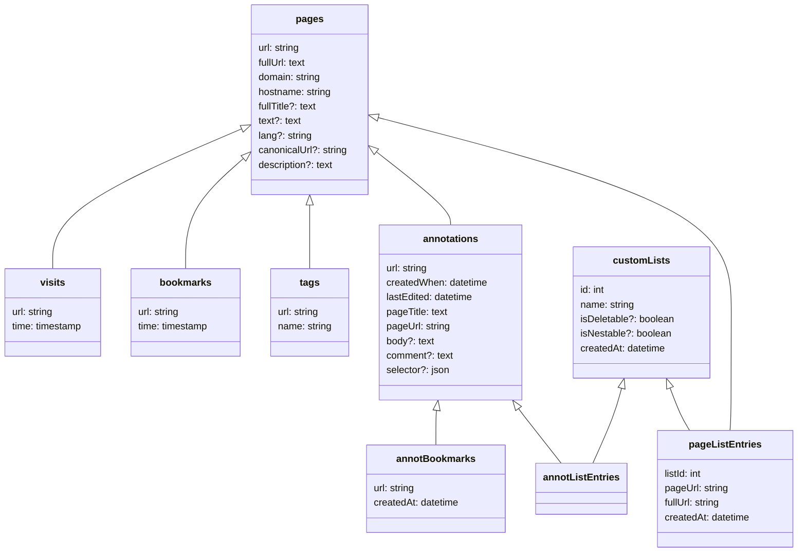

# Integrating with Memex

Integrating with Memex allows you to: 
  1. Listen to data changes in Memex
  2. Index urls on demand 
  3. Export & import data on demand


## 1. Setting up the environment. 

### 1. Enable feature that Memex can talk to outside applications
By default Memex does not connect to StorexHub. To open the connection open the background console of Memex and type ```TODO```

### 2. Start StorexHub and install Memex plugin
1. Download StorexHub & start it. 
2. Download the Memex plugin & install it. 

TODO: 
- how is the memex plugin packaged? prepackaged?
- Add links to StorexHub executable

## 2. Use Cases:
### 1. Listen to data changes in Memex. 
With this method you can listen to every change in Memex and process it individually. 

TODO: Example

### 2. Index urls on demand
You can use Memex internal indexing process to add new urls to your, or your plugin's users, history/bookmarks. 

```js
interface IndexPageArgs {
  url: string;
  visitTime?: number;
  bookmark?: true | { creationTime: number };
  tags?: string[];
}
```

```js
const { status } = await api.executeRemoteCall({
  app: "io.worldbrain.memex",
  call: "indexPage",
  args: {
    url: "https://en.wikipedia.org/wiki/Memex",
    visitTime: Date.now(), // Is set to Date.now() if omitted
    bookmark: true,
    tags: ["my-tag"],
  },
});
if (status === "success") {
  // do something
}
```

TODO: 
- add collections to this request too
- I am not sure how to interpret the "indexpageargs "part? Does this need to be added to the 
- have parameter that allows for full-text indexing y/n (later)

### 3. Import/Export data on demand: 

#### Examples: 

**get all pages tagged with `share-test`:**

```js
const { status, result: pages } = await api.executeRemoteOperation({
  app: "io.worldbrain.memex",
  operation: ["findObjects", "tags", { name: "share-test" }],
});
```

**get all pages visited in the last 3 hours:**

```js
const { status: result: visits } = await api.executeRemoteOperation({
  app: "io.worldbrain.memex",
  operation: [
    "findObjects",
    "visits",
    { time: { $gt: Date.now() - 1000 * 60 * 3 } },
  ],
});
```

**get page details by URL**

With the above commands you will onyl get the respective url back (and tag/visit time respectively). 
To get all page data, like `title`, `text` or other metadata, you need to then loop through your previous results and fetch the page data with the following command. 

```js
const { status, result: page } = await api.executeRemoteOperation({
  app: "io.worldbrain.memex",
  operation: ["findObjects", "pages", { url: "test.com/" }],
});
```

TODO: 
- add examples on how to WRITE things to the DB. 
- make a list of all commands like "findobjects" etc. 


## 3. Understanding Memex' data model

### How to read this
- Optional fields are marked with `?`
- Generally the ID of each data class is the first field (mostly `url`)
    - Exceptions: 
       - annotations: The `url` + `createdWhen` field ID in the format: `http://www.page.com#creationTimestamp`
       - annotBookmarks: The respective annotation's url in the format: `http://www.page.com#creationTimestamp`
       - pageListEntries: The customLists ID + `url` as an array the format: `[1, 'http://www.page.com']`
- `url` fields in `pages`, `bookmarks`, `visits` and `pageListEntries` are normalized URLs.
- All the data classes with an arrow to another class can't be displayed without their existence. (e.g. `bookmarks` status without having a `pages` object)





